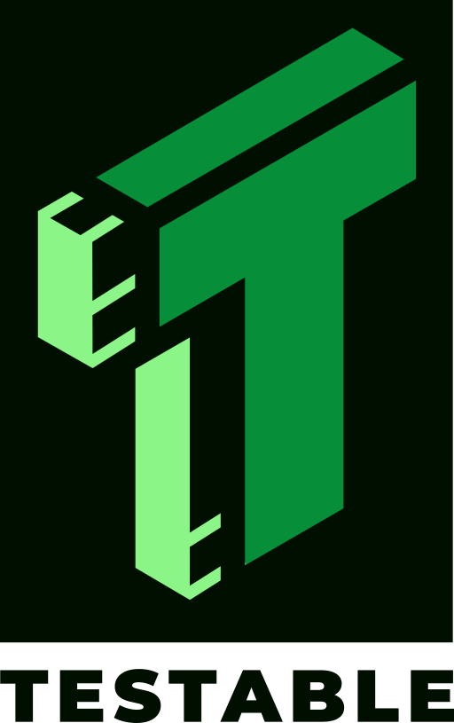

# ModSec-AdvLearn

## How to cite us

If you want to cite us, please use the following (BibTeX) reference:
```bibtex
```

## Getting started

### Setup

1. [Compile and install ModSecurity v3.0.10](#compile-modsecurity-v3010)
2. [Install pymodsecurity](#install-pymodsecurity)
3. [Clone the OWASP CoreRuleSet](#clone-the-owasp-coreruleset)
4. [Run experiments](#run-experiments)

### Compile ModSecurity v3.0.10 

First of all, you will need to install [ModSecurity v3.0.10](https://github.com/SpiderLabs/ModSecurity/releases/tag/v3.0.10) on your system.
Currently, this is a tricky process, since you will need to [build ModSecurity v3.0.10 from source](https://github.com/SpiderLabs/ModSecurity/wiki/Compilation-recipes-for-v3.x)
(although some distros might have an updated registry with ModSecurity 3.0.10 already available)

### Install pymodsecurity

In `modsec-learn` ModSecurity methods are implemented via [pymodsecurity](https://github.com/pymodsecurity/pymodsecurity).
Since development on the official repository stopped on ModSecurity v3.0.3, the current workaround is: clone [this fork](https://github.com/AvalZ/pymodsecurity) and [build it from source](https://github.com/AvalZ/pymodsecurity#building-from-source)

### Clone the OWASP CoreRuleSet

To detect incoming payloads, you need a Rule Set.
The *de facto* standard is the [OWASP CoreRuleSet](https://github.com/coreruleset/coreruleset), but of course, you can choose any Rule Set you want, or customize the OWASP CRS.

To run the recommended settings, just clone the OWASP CRS in the project folder:
```
git clone --branch v4.0.0 git@github.com:coreruleset/coreruleset.git
```

### Run experiments

All experiments can be executed using the Python scripts within the `scripts` folder. The scripts must be executed starting from the project's root.
```bash
python3 scripts/<script_name>.py
```

## Acknowledgements

ModSec-AdvLearn has been partly supported by the [TESTABLE project](https://testable.eu/), funded by the EU H2020 research and innovation program (grant no. 101019206); the [ELSA project](https://elsa-ai.eu/), funded by the Horizon Europe research and innovation program (grant no. 101070617); projects [FAIR (PE00000013)](https://fondazione-fair.it/) and [SERICS (PE00000014)](https://serics.eu/) under the NRRP MUR program funded by the EU – NGEU.

 &nbsp;&nbsp; 
 &nbsp;&nbsp;
 &nbsp;&nbsp;
 &nbsp;&nbsp;

